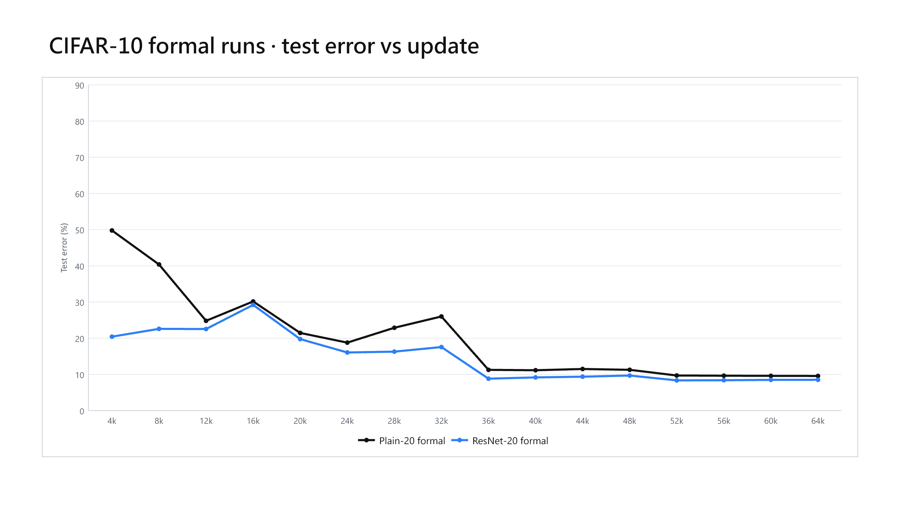
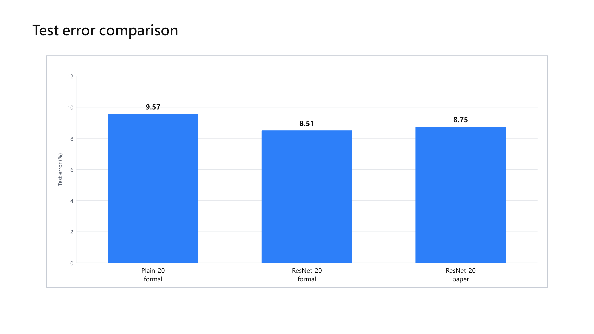

# 在 CIFAR-10 上復現 Plain-20 與 ResNet-20

這個專案用白話來說，是在驗證一件事：**同樣都是 20 層的卷積神經網路，加上 ResNet 的「捷徑連接」之後，模型是否會比較容易訓練，也能得到更好的影像分類結果？**

專案復現的是何愷明等人在論文 [Deep Residual Learning for Image Recognition](https://arxiv.org/abs/1512.03385) 中的 CIFAR-10 實驗。範圍限於 **Plain-20** 與 **ResNet-20**，並不是整篇論文或 ImageNet 實驗的完整重做。

## 白話理解這次復現

- **Plain-20**：影像依序通過 20 層網路，每一層只能接收前一層的結果。
- **ResNet-20**：大部分結構與 Plain-20 相同，但加入 shortcut／skip connection，讓原始訊息可以跨過部分層直接往後傳。
- **比較目的**：在資料、訓練次數與主要設定固定的情況下，觀察 shortcut 是否能改善 20 層網路的訓練與分類表現。

ResNet 的核心想法不是單純「增加更多層」，而是讓網路學習輸入與輸出之間的差值（residual）。當某些層不需要大幅改變資訊時，捷徑連接讓訊息和梯度更容易通過深層網路。

## 最終結果

兩個模型都使用第 **64,000 次參數更新**後的 checkpoint 作為正式結果，沒有利用測試集挑選最佳 checkpoint。

| 模型 | 正確數／測試影像 | Accuracy | Test error | 論文可確認結果 | 差異 |
| --- | ---: | ---: | ---: | ---: | ---: |
| Plain-20 | 9,043／10,000 | 90.43% | 9.57% | 本專案採用的主要來源未提供可安全引用的精確值 | 不宣稱數值差異 |
| ResNet-20 | 9,149／10,000 | 91.49% | 8.51% | 8.75% | -0.24 個百分點 |

在本次單一固定實驗中，ResNet-20 比 Plain-20 多辨識正確 **106 張**影像，test error 由 9.57% 降至 8.51%，下降 **1.06 個百分點**。ResNet-20 的 8.51% 也比論文表列的 8.75% 低 0.24 個百分點；這不代表全面超越論文，只代表在本專案記錄的硬體、程式框架與假設下得到此結果。





完整數值與說明請見 [results/comparison.md](results/comparison.md)。

## 可下載成果

[`v1.0.0` GitHub Release](https://github.com/ChenBill900703/repro-resnet20-cifar10/releases/tag/v1.0.0) 提供：

1. `plain20_checkpoint_update_064000_final.pt`：Plain-20 的第 64,000 update 最終權重。
2. `resnet20_checkpoint_update_064000_final.pt`：ResNet-20 的第 64,000 update 最終權重。
3. `resnet20_cifar10_professor_report.pptx`：給教授檢視的 PowerPoint 報告。

Repository 內另有 [PDF 報告](docs/reports/resnet20_cifar10_professor_report.pdf)。

## 實驗設定摘要

| 項目 | 設定 |
| --- | --- |
| Dataset | CIFAR-10 官方 50,000 張訓練影像與 10,000 張測試影像 |
| 模型 | Plain-20、CIFAR-10 post-activation ResNet-20 |
| Optimizer | SGD |
| Batch size | 128 |
| Initial learning rate | 0.1 |
| LR schedule | 第 32,000、48,000 update 各除以 10 |
| Training end | 64,000 updates |
| Momentum | 0.9 |
| Weight decay | 0.0001 |
| Seed | 1 |
| Precision | FP32，未使用 AMP、TF32 |
| GPU | NVIDIA GeForce RTX 3070 Ti |
| Python | 3.11.9 |
| PyTorch | 2.13.0+cu126 |

完整設定保存在 [configs/cifar10_plain20_resnet20_frozen.yaml](configs/cifar10_plain20_resnet20_frozen.yaml)。

## 專案如何確保結果可追蹤

這不是只留下兩個模型檔案。專案同時保存：

- 論文明確說明的設定、為了完成實作而採用的假設，以及目前仍未知的細節。
- 固定且具雜湊值的實驗設定與 CIFAR-10 training-set mean artifact。
- 模型、資料處理、optimizer、checkpoint 與 exact-resume 的測試。
- 正式實驗的最終指標、環境版本、圖表與報告。
- 禁止使用測試集調參或選擇最佳 checkpoint 的規則。

測試與正式執行前檢查曾記錄 **150 tests passed**。研究決策可從以下文件開始閱讀：

- [重現規格](docs/reproduction_spec.md)
- [原始來源檢查](docs/primary_source_review.md)
- [來源追蹤](docs/source_traceability.md)
- [假設清單](docs/assumptions.md)
- [決策紀錄](docs/decision_log.md)
- [結果來源與限制](docs/provenance.md)

## Repository 結構

```text
configs/       固定的正式實驗設定
src/           Plain-20、ResNet-20、資料處理與訓練核心程式
scripts/       preflight、smoke test 與正式訓練入口
tests/         Phase 0～4 測試
docs/          論文證據、假設、決策、規格與報告
environment/   軟硬體與套件版本
artifacts/     經雜湊驗證的 CIFAR-10 training-set mean
results/       精簡後的正式指標、圖表與比較
```

大型 CIFAR-10 資料、虛擬環境、中途 checkpoints 與完整逐步訓練 logs 不提交到 GitHub。

## 快速開始

### 1. 建立環境

Windows PowerShell：

```powershell
python -m venv .venv
.\.venv\Scripts\Activate.ps1
python -m pip install --upgrade pip
pip install -r requirements.txt
```

完整鎖定版本在 `environment/requirements-lock.txt`。其中 PyTorch／CUDA 套件需依執行平台與官方安裝方式調整。

### 2. 下載 CIFAR-10

```powershell
python -c "from torchvision.datasets import CIFAR10; CIFAR10('data', train=True, download=True); CIFAR10('data', train=False, download=True)"
```

### 3. 執行測試

```powershell
python -m pytest tests -q
```

### 4. 執行短程 smoke test

```powershell
python scripts/train.py --model resnet20 --mode smoke --updates 100 --run-dir runs/resnet20_smoke
```

### 5. 執行正式訓練

正式訓練固定為 64,000 updates，必須從乾淨的 Git working tree 執行，並先產生相同版本的 PASS preflight report。請先閱讀 `docs/` 中的證據邊界與執行規則：

```powershell
python scripts/preflight.py --output runs/formal_preflight.json
python scripts/train.py --model plain20 --mode formal --run-dir runs/plain20_formal --preflight-report runs/formal_preflight.json
python scripts/train.py --model resnet20 --mode formal --run-dir runs/resnet20_formal --preflight-report runs/formal_preflight.json
```

若研究流程要求鎖定到單一 Git commit，可在執行前設定 `RESNET_REPRO_EXPECTED_COMMIT`；未設定時仍會透過乾淨 working tree、frozen config、mean artifact hash 與 preflight report 保留可追蹤性。

## 重要限制

- 這是一次有明確範圍的重現研究，不是原作者官方實作。
- 論文未交代的細節沒有被包裝成論文明確事實；相關選擇標記為 assumption 或 unknown。
- 正式結果來自固定 seed 的單次實驗，不足以代表多次重跑後的統計分布。
- 原始正式訓練 manifest 記錄執行當下工作目錄存在尚未提交的變更；本 Repository 是整理後的公開快照。詳細影響見 `docs/provenance.md`。
- 不應只根據 8.51% 與 8.75% 的差異宣稱方法優於論文；框架、硬體與未公開實作細節都可能造成偏差。

## 引用

```bibtex
@inproceedings{he2016deep,
  title={Deep Residual Learning for Image Recognition},
  author={He, Kaiming and Zhang, Xiangyu and Ren, Shaoqing and Sun, Jian},
  booktitle={Proceedings of the IEEE Conference on Computer Vision and Pattern Recognition},
  year={2016}
}
```

原論文：https://arxiv.org/abs/1512.03385
